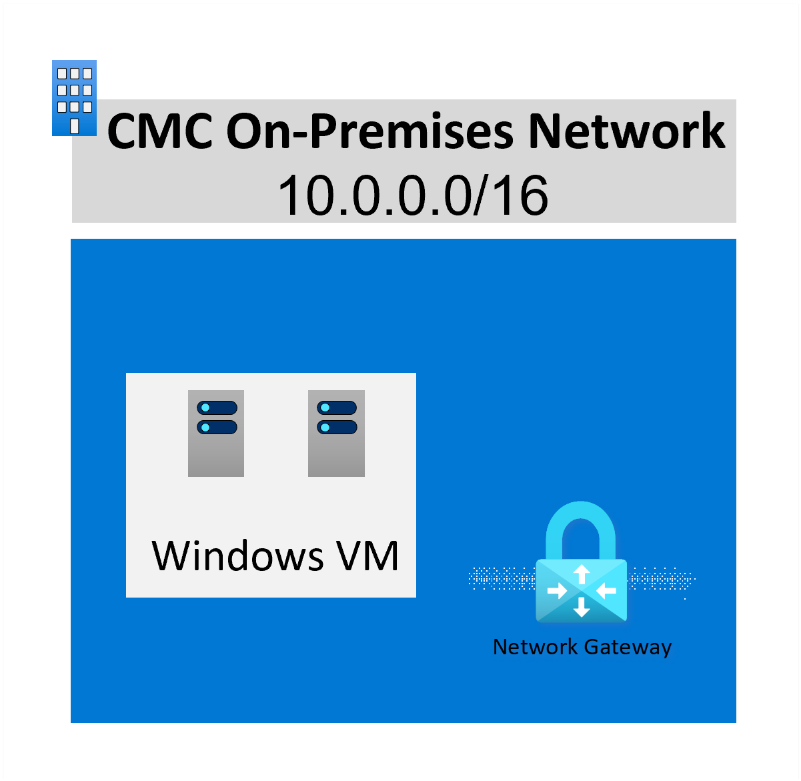

# Challenge 1: Build the foundation

## Background

Networking is a critical component for any solution to ensure performance, resilience, and security, which is only magnified when considering hybrid environments. Designing and implementing Azure networking solutions is a core component of this hackathon. You'll need to make networking design decisions as you progress through the challenges.

The objective of this challenge is to ensure you understand Azure Virtual Networks, Azure connectivity capabilities, and how to establish a hybrid connection to Azure.

## Challenge

The Contoso Mortgage Company needs a network solution in Azure that provides hybrid connectivity to the company’s headquarters and its various branch locations. This will extend their workloads to their customers all over the world. This network solution should be centrally managed while being scalable based on regional demands.

Currently CMC uses 10.0.0.0/16 for their on-premises network. The network admin team has allocated 10.1.0.0/16 address space for all Azure networking.

The following on-premises resources can be used to connect to Azure:

- VPN Gateway "vpn-on-prem" with Public IP “pip-onprem-vpn-gateway” attached.

For testing the on-premises server (not the SQL Server!) can be accessed with the following username and password:

    - demouser
    - demo!pass123

## Requirements

- CMC requires an Azure networking IP address plan presented to them. Where applicable, IP addresses should be contiguous.
- The solution must be scalable, secure, and resilient and be aligned to the zero trust principles.
- The primary Azure region CMC will use is Sweden Central.
- You need to design connectivity for YADA, including from on-premises and from any resources in Azure.
- You need to plan and document network design and connectivity solution.
- The design must include central access to shared services.
- You must deploy a test VM in Azure to validate connectivity between on-premises and Azure.
- The solution must be cost-effective solution and should take advantage of cloud resiliency to individually meet the SLA requirement of 99.99% as far as possible.
- Secure remote access to servers must be provided to the consultants for them to continue their work. A single hardened access point is required.

## Success Criteria

To successfully complete this challenge as a team you must:

- Present to your coach your network design. This must include at a network topology diagram and an IP address plan.
- Present the virtual network deployment in your subscription (only deploy after you've agreed with both your coach and team your network design).
- Present the cross-premises connection in your subscription.
- Validate your hybrid connection to the on-premises network from Azure
- Implement a solution that alerts when the connectivity between Azure and on-premises is down.
- Discuss the decisions of the proposed solution that impact security, reliability, and cost.
- Demonstrate secure remote access.

## References

- [Azure networking services overview](https://learn.microsoft.com/azure/networking/fundamentals/networking-overview)
- [Azure Networking products](https://azure.microsoft.com/products/category/networking/)
- [Networking architectures](https://learn.microsoft.com/azure/architecture/guide/networking/networking-start-here#networking-architectures)
- [Plan Azure Virtual Networks](https://learn.microsoft.com/azure/virtual-network/virtual-network-vnet-plan-design-arm)
- [IP Address Planning](https://learn.microsoft.com/en-us/azure/cloud-adoption-framework/ready/azure-best-practices/plan-for-ip-addressing)
- [IP Address Planning template](https://github.com/jonathan-vella/architecting-for-success/blob/main/102-Azure-Landing-Zones/docs/Azure%20Network%20Documentation%20Template.xlsx)
- [Hub-and-spoke network topology in Azure](https://learn.microsoft.com/en-us/azure/architecture/reference-architectures/hybrid-networking/hub-spoke)
- [Hub-and-spoke network topology with Azure Virtual WAN](https://learn.microsoft.com/en-us/azure/architecture/networking/hub-spoke-vwan-architecture)
- [Create site-to-site connections using Virtual WAN](https://learn.microsoft.com/en-us/azure/virtual-wan/virtual-wan-site-to-site-portal)
- [Connect an on-premises network and a virtual network: S2S VPN](https://learn.microsoft.com/en-us/azure/vpn-gateway/tutorial-site-to-site-portal)
- [Apply Zero Trust principles to Azure services](https://learn.microsoft.com/en-us/security/zero-trust/apply-zero-trust-azure-services-overview)

_(c) Microsoft 2022_
