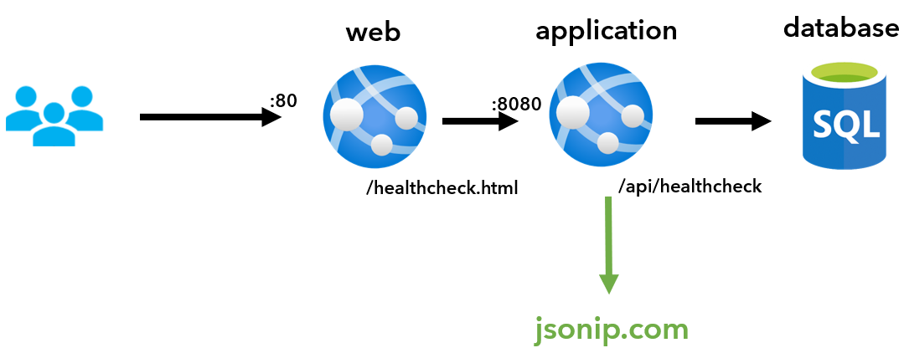

# Challenge 6: Secure access to Azure PaaS services

## Background

In this challenge, you will integrate and secure PaaS resources into your network design and configure DNS.

The objective of this challenge is to demonstrate your understanding of PaaS and DNS services available in Azure and how they can be securely integrated into a virtual network.

## Challenge

CMC needs you to ensure all PaaS services hosted on Azure that need to communicate to each other are leveraging the Microsoft Azure Backbone and do not go out to the public internet and back to the private network.

A team of Azure consultants have strongly recommended modernizing YADA, and your team has been tasked with executing their recommendation.

## Requirements

CMC has the following requirements:

The app architecture:



- The Web tier and the API tier need to be deployed as containerized Azure Web Apps. You can use the guidance located [here](../hacker-assets/sol_challenge06.md) to deploy both tiers in Azure App Service.
- Both tiers should not be directly exposed to the internet, and all users must be directed through a WAF before accessing the application. You need to also ensure that clients can’t bypass the firewall by using \*.azurewebsites.net
- The Web tier should be able to communicate with the API tier using a private IP address.
- The API tier should be able to communicate with the Azure SQL database using a private IP address.
- At this stage, CMC decided to use an Azure SQL database with SQL authentication in the S0 tier with locally redundant storage. The Database should not be publicly accessible and needs to be only accessible with a private IP using a DNS name.
- In the future CMC want to enforce the use of encryption, private endpoints and DNS integration for Azure SQL. They want you to provide them with options and guidance how to achieve this.
- CMC has requested an estimate of the downtime during the transition to App services.

## Success Criteria

- Present an updated environment diagram.
- Present a high-level migration plan.
- Refactor YADA to use App Service and ensure that API is using a private IP address to access the DB and that no one is able to access the DB using a Public IP.
- Demonstrate how both App Service and Azure SQL can be configured with a 99.99% uptime SLA.
- Verify that users in various regions are directed to the closest workload.
- Simulate a regional outage and verify that traffic is redirected to the next closest region.
- With the exception of Azure Firewall, Application Gateway, and the VPN Gateway, no other public IP addresses should be used.
- DNS concepts should be understood and explained in the solution.

## Application Gateway Stop Start PowerShell Script

```powershell
$AppGw = Get-AzApplicationGateway -Name waf-yada-swc01 -ResourceGroupName rg-spoke-swc01
Stop-AzApplicationGateway -ApplicationGateway $AppGw
Start-AzApplicationGateway -ApplicationGateway $AppGw
```

## References

- [Private Link and DNS integration at scale](https://docs.microsoft.com/en-us/azure/cloud-adoption-framework/ready/azure-best-practices/private-link-and-dns-integration-at-scale)
- [Network-hardened web app](https://learn.microsoft.com/en-us/azure/architecture/example-scenario/security/hardened-web-app)
- [Securely managed web applications](https://learn.microsoft.com/en-us/azure/architecture/example-scenario/apps/fully-managed-secure-apps)
